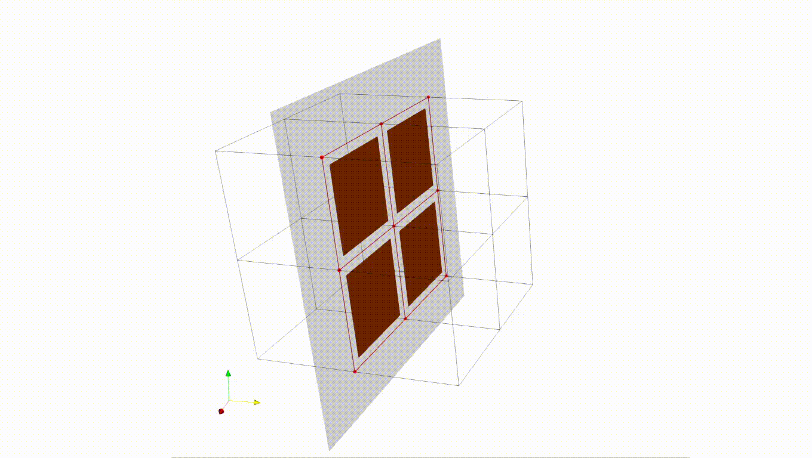

# CILAMCE 2020 - Examples

This is a repository for the examples used in the paper **Multi-scale meshing for 3D discrete fracture networks** currently under review by CILAMCE scientific committee.

## Instructions

To use the python scripts to run the examples, the user should have the [DFNMesh](https://github.com/PedroLima92/dfnMesh) project compiled in their system, along with its dependancies (NeoPZ, and GMsh). Instructions on how to build the code can be found at the project repository, together with link to install instructions of the dependencies.

Please note that this is a project in development and is currently only tested in Linux and MacOS.

The version used to generate the results is the commit:
  #[5c6f408d952e45d397fa93ec15814aa2ad7385dc](https://github.com/PedroLima92/dfnMesh/tree/5c6f408d952e45d397fa93ec15814aa2ad7385dc)
  

## Preview

### Example 1

